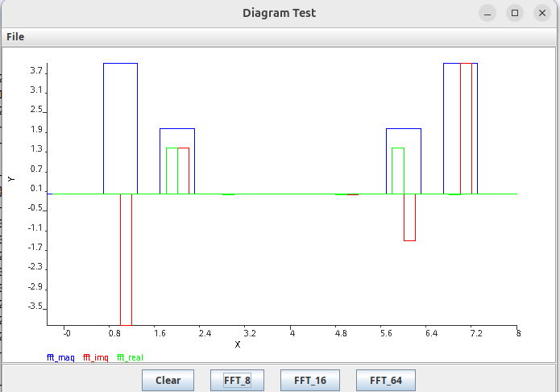
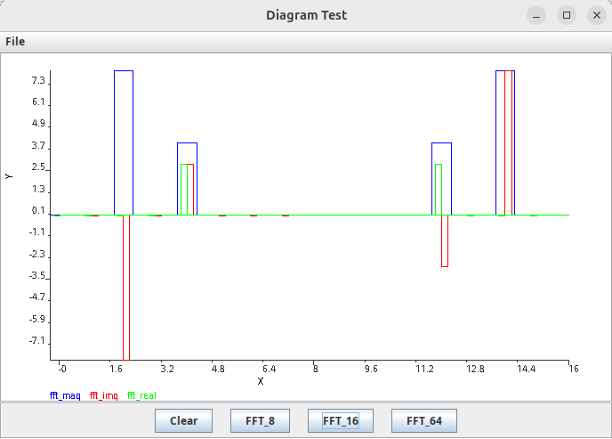
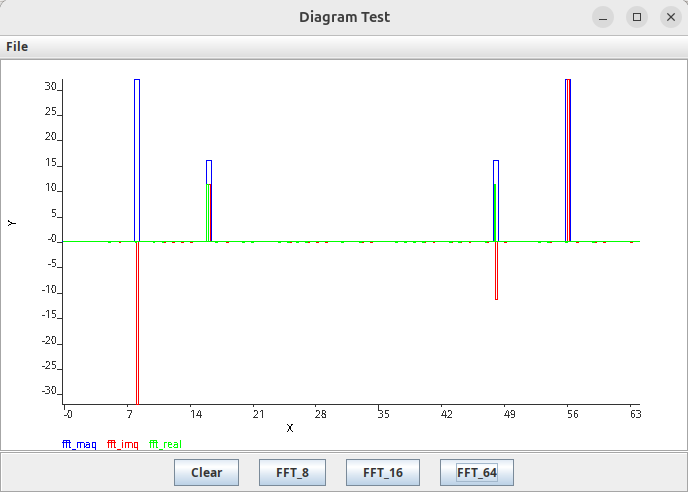

# fft_java
This projects contains the  source code of lab module of FFT calculation and display implementation with Java.

## ChartPlot
The ChartPlot class handles all the gui and fft plot implementation.

## FFTcta
The FFTcta class contains the algorithm to calculate the FFT of 8, 16 and 64 samples.

## Results
The input singal whose fft is to be calculated contains the sum of two signals with frequencies of 1Khz and 2khz with phase shift of 45 degree.
### FFT with 8 samples

## FFT with 16 samples

## FFT with 64 samples
